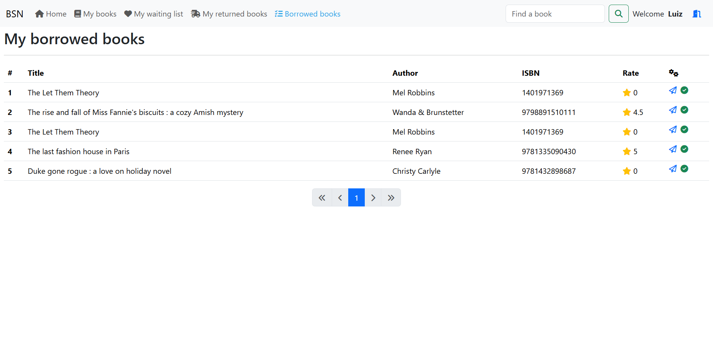

# Book social network

This project has been done following [this video](https://www.youtube.com/watch?v=WuPa_XoWlJU) by Bouali Ali ([Original git repository](https://github.com/ali-bouali/book-social-network)). 

The project uses Spring Boot and Java 17 for the back-end, and Angular/TypeScript on the front-end.

## Run & Requirements

To run the entire suite, the following is required:
- Docker
- Node.JS

It's possible to launch the back-end as a standalone application and use Postman or similar to send requests to the available endpoints, or `ng serve` the `book-social-network-ui` directory to have the application locally on `http://localhost:4200/login`.

## Screenshots

Login screen

Home page after login

My borrowed books page

